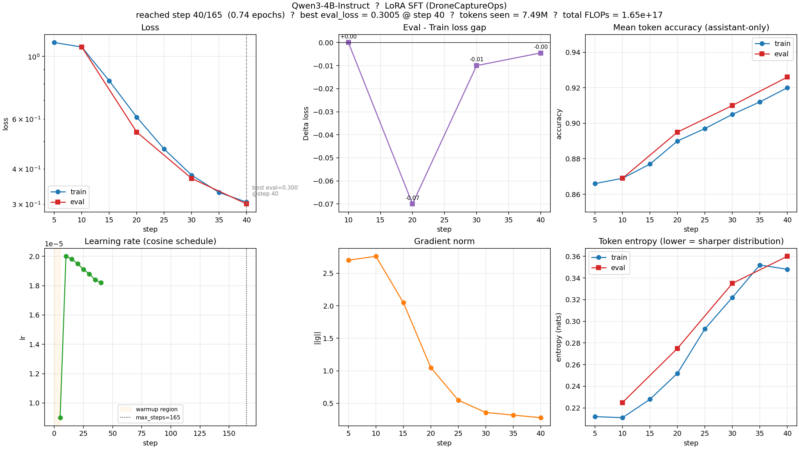
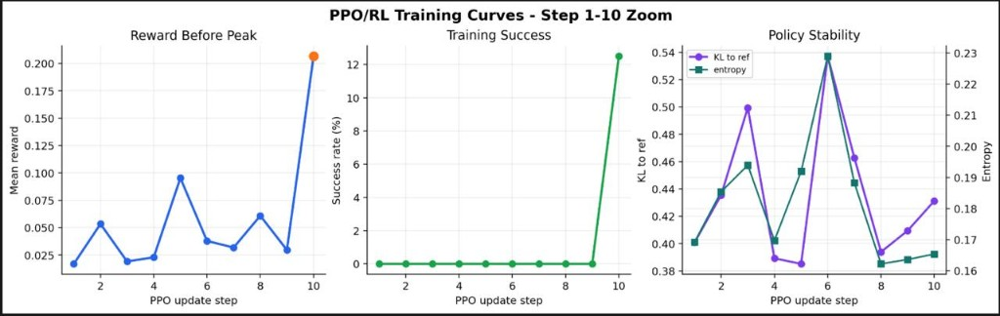
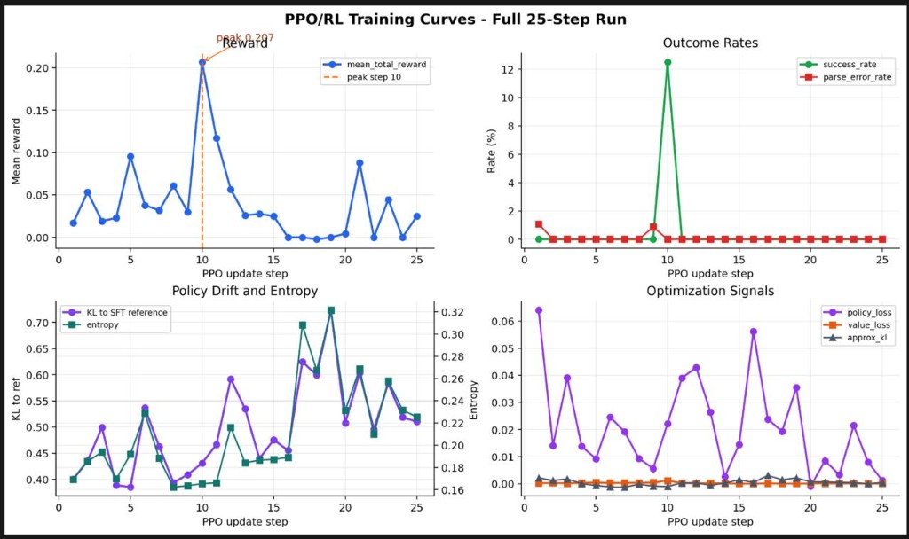
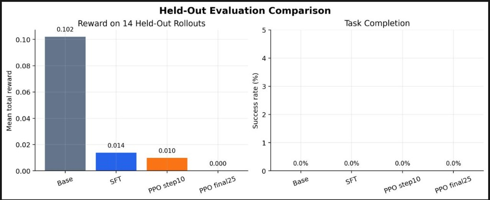

# DroneCaptureOps Gym: Training LLMs To Act As Drone Inspection Directors

## TL;DR

DroneCaptureOps Gym is an OpenEnv-compatible RL environment where the agent
acts as an aerial **inspection director**. It does not control motors. It
issues high-level tool calls — mission review, safe waypoint flight,
gimbal/camera control, RGB and thermal capture, capture inspection,
return-home, and final evidence-pack submission — and is graded on whether
the evidence it actually collected supports the report it actually filed.
The goal is to train LLMs into reliable drone operating-system agents that
can plan, capture grounded evidence, stay safe, and report honestly.

---

## Watch The Demo First

The fastest way to understand the submission is the demo video:

**[Watch the DroneCaptureOps Gym submission demo](https://www.youtube.com/watch?v=ooE8gAG3Oa0)**

The video shows the project as an actual OpenEnv-style aerial inspection
environment: a mission with visible state, structured drone-operation tools,
evidence capture, reward feedback, and the live inspection console. The rest
of this writeup explains the environment design, training stack, and
diagnostic results behind that demo.

---

## Why This Problem Matters

Solar farms, bridges, construction sites, industrial plants, disaster zones,
and perimeter patrols all need recurring aerial inspection. Today a human
operator (or a team) decides where to fly, what to capture, when evidence is
"enough," when to recapture, and how to write the final report. Those
decisions are the hard part — autopilot already handles flight.

LLM agents need environments that exercise that grounded operational
judgment, not toy game behavior. DroneCaptureOps focuses on:

- deciding what evidence is missing,
- deciding where to capture next,
- deciding when to recapture vs. move on,
- avoiding no-fly zones and battery dead-ends,
- and only citing evidence the agent actually has.

If a model can do this consistently across deterministic tasks, the same
behavior transfers cleanly to a real inspection workflow.

---

## What The Environment Simulates

- OpenEnv-compatible RL environment (`spec_version: 1`,
  `app: server.app:app`).
- Current fleshed-out domain: **solar farm inspection**. `bridge`,
  `construction`, and `industrial` builders exist as placeholders.
- Backend: deterministic geometry simulator via `GeometryController`. A
  `DroneKitSITLController` adapter exists as a placeholder for future
  ArduPilot/SITL work.
- Agent role: **inspection director**, not a flight controller.
- Tool surface: mission/map, flight, camera/gimbal, evidence/report.
- Hidden vs. visible state is enforced as an invariant: hidden defects,
  true asset state, and verifier-only labels live only in `EpisodeWorld`
  and never appear in observations.

The benchmark is **active visual inspection** — collecting grounded
evidence — not shortest-path navigation.

---

## Action Space

Actions are structured tool calls. The public surface is built from a
single `ToolRegistry`, so validation and availability come from one place.

Categories:

- **Mission/map**: `get_site_map`, `get_mission_checklist`,
  `get_telemetry`, `list_assets`, `estimate_view`,
  `estimate_return_margin`, `request_route_replan`
- **Flight**: `takeoff`, `fly_to_viewpoint`, `move_to_asset`, `hover`,
  `return_home`, `land`
- **Camera/gimbal**: `set_gimbal`, `set_zoom`, `set_camera_source`,
  `point_camera_at`, `capture_rgb`, `capture_thermal`, `inspect_capture`
- **Evidence/report**: `mark_target_inspected`, `submit_evidence_pack`

Example action:

```json
{
  "tool_name": "fly_to_viewpoint",
  "arguments": {
    "x": 30,
    "y": 24,
    "z": 22,
    "yaw_deg": -90,
    "speed_mps": 5
  }
}
```

---

## Observation Space

Observations include:

- visible mission instructions and task-conditioned objective,
- telemetry (pose, velocity, gimbal, camera state),
- battery and weather (visible portions only),
- site map and visible assets,
- airspace zones (no-fly / restricted),
- capture log and last capture (with quality metadata),
- evidence artifacts (real captured photo IDs),
- checklist status,
- reward breakdown (including `debug` payload distinguishing shaping vs.
  outcome reward).

What observations **do not** include: hidden defects, true asset state,
hidden weather details, obstacle schedules, and verifier evidence
requirements. `tests/test_no_hidden_state_leakage.py` enforces this.

---

## Tasks And Difficulty

Three default baseline tasks span easy → medium → hard:

- **Easy**: `basic_thermal_survey` — fly the rows, capture thermal
  overview, submit a clean evidence pack.
- **Medium**: `anomaly_confirmation` — find and confirm a thermal anomaly
  with a corresponding RGB close-up.
- **Hard**: `audit_grade_strict_grounding` — strict integrity gate;
  reports must cite real captured artifact IDs, with no unsupported
  claims.

The `solar_tasks` catalog (`dronecaptureops/tasks/solar_tasks.py`) defines
30+ deterministic, programmatically graded mission variants — including
low-battery, obstacle detour, privacy zones, edge-row quality bars, glare
artifacts, and severity-weighted triage. Tasks are the unit of RL
task-conditioning. Scenario suites
(`smoke`, `curriculum_easy`, `curriculum_medium`, `hard_eval`, `demo`,
`solar_tasks`) are the unit of benchmark/regression reporting.

---

## Reward Design

Reward is published every step but its meaning depends on whether the agent
has called `submit_evidence_pack`:

- **Before submission** — `total` is a small *shaping* reward derived from
  captured progress; outcome scoring is suppressed so the agent cannot farm
  reward by hovering and capturing forever.
- **After submission** — `total` is the actual mission outcome score using
  *cited* evidence, with safety and integrity caps applied. `done=True`.

Terminal formula:

```
total = clamp(min(safety_gate, integrity_gate,
                  0.45*evidence_success
                + 0.20*required_coverage
                + 0.15*issue_capture
                + 0.10*operational_efficiency
                + 0.10*grounded_report
                + process_reward
                - penalties),
              -1, 1)
```

`safety_gate` and `integrity_gate` are **caps, not multipliers**. A no-fly
violation caps total at ~0.10. Citing fake or unsupported photo IDs caps
via integrity. `process_reward` is bounded at 0.10 so dense shaping never
dominates the outcome. This pushes the model toward grounded, safe
behavior rather than reward farming.

---

## OpenEnv Compliance

- `openenv.yaml` declares `name: dronecaptureops-gym`,
  `runtime: fastapi`, `app: server.app:app`, `port: 8000`.
- `server.app:app` exposes the OpenEnv `reset` / `step` / `state`
  endpoints, plus a live-session API under `/live/*` and the rich-sim
  console at `/ui/`.
- Repo contains a root `inference.py` that runs an episode end-to-end
  with any of `scripted`, `random`, `openai`, `anthropic`, `hf` policies
  using a shared `RolloutRunner`.
- Root `Dockerfile` is present and starts `uvicorn server.app:app` on
  port 8000.
- `scripts/validate-submission.sh` checks a deployed Space `/reset`,
  builds the Docker image, and runs `openenv validate`.
- Hugging Face Space deployment uses the OpenEnv CLI:

```bash
openenv push --repo-id <hf-username>/dronecaptureops-gym
```

The repo is packaged as a FastAPI OpenEnv Space rather than a notebook-only
demo: the same server powers automated OpenEnv rollouts and the live browser
inspection console.

---

## Inference And Baseline

Run the scripted baseline locally:

```bash
python inference.py --task basic_thermal_survey --policy scripted
```

The CLI also supports `--policy openai`, `--policy anthropic`, and
`--policy hf` (with `--model`, `--api-base-url`, `--api-key`,
`--temperature`, `--max-tokens`). Output is a JSON summary with
`task_id`, `policy`, `seed`, `steps`, `total_reward`, `success`,
`anomalies_detected`, `anomaly_rgb_pairs`, and remaining battery.

For full per-step traces during evaluation:

```bash
python -m training.run_suite --suite smoke --policy scripted
python -m training.trace_episode --suite demo --episode-index 0 \
  --policy scripted --output-dir artifacts/trace-demo
```

---

## Training Setup

The training stack is intentionally separated from the core OpenEnv server,
so judges can run the environment without heavyweight GPU dependencies.
The optional `train` / `ppo` extras contain the model-training code.

The current pipeline has three layers:

1. Generate SFT warm-start data from deterministic scripted/teacher
   rollouts.
2. SFT-warm-start `Qwen/Qwen3-4B-Instruct-2507` into the structured
   DroneCaptureOps tool-call format.
3. Continue with RL on the live environment. PPO configs and HF Jobs
   launchers are present; `training/train_grpo.py` is a scaffold for a
   future GRPO/RLVR path, not a claimed final submission model.

Commands:

```bash
python -m training.generate_sft_data \
  --config training/configs/sft_default.yaml \
  --output artifacts/sft/sft-warmstart.jsonl
```

```bash
python -m training.sft_warmstart \
  --config training/configs/sft_train_default.yaml \
  --dataset artifacts/sft/sft-warmstart.jsonl \
  --output-dir artifacts/sft-checkpoints
```

```bash
python -m training.train_ppo \
  --config training/configs/ppo_train_default.yaml
```

W&B tracking is wired into both SFT and PPO trainers.

---

## Training Results

- TODO: add final training data / model metrics summary after the final run
  outputs are available.

The training runs are best read as diagnostics for the environment and reward
design. They show that the benchmark gives dense learning signal, exposes
policy drift, and separates partial reward-seeking from true held-out task
completion.

### SFT Warm-Start Snapshot

The SFT adapter learns the DroneCaptureOps tool-call format cleanly: loss falls
steadily, train/eval token accuracy improves, and the eval-train gap remains
small by the best checkpoint.



### PPO/RL Learning Signal

The short PPO/RL run shows a clear early reward peak around update 10 and a
brief non-zero task-completion signal. The zoomed view is useful because it
shows the first moment where the policy begins converting the SFT warm start
into environment reward.



Across the full 25-step run, the diagnostic curves also show why this is a hard
benchmark: reward peaks early, then policy drift/entropy rise and the final
policy loses the temporary gain. That makes the environment valuable for
training research because it catches reward spikes that do not become stable
mission policies.



### Held-Out Generalization Check

The held-out comparison is intentionally strict: partial reward exists, but
task completion is not yet solved by base, SFT, or the short PPO checkpoints.
This is an honest stress test rather than a polished leaderboard claim, and it
is exactly the kind of signal needed before scaling longer RL runs.



The SFT and PPO diagnostics should be read as training infrastructure and
reproducibility evidence, not as a claim that a final RL policy already beats
the scripted benchmark. The strongest completed evidence in this submission is
the environment, verifier, reward design, deterministic task suite, and
traceable baseline/evaluation stack.

---

## How Judges Can Run It

Local end-to-end:

```bash
pip install -e ".[dev]"
pytest                                              # fast deterministic suite
python inference.py --task basic_thermal_survey --policy scripted
python -m training.run_suite --suite smoke --policy scripted
dronecaptureops-server                              # OpenEnv + live UI on :8000
```

Containerized:

```bash
docker build -t dronecaptureops-gym .
docker run --rm -p 8000:8000 dronecaptureops-gym
```

Submission validator:

```bash
./scripts/validate-submission.sh https://<hf-username>-dronecaptureops-gym.hf.space .
```

Hugging Face Space deployment:

```bash
openenv push --repo-id <hf-username>/dronecaptureops-gym
```

Notebook for judges:

- `training/colab_training_template.ipynb` shows the intended SFT/RL
  training workflow and links back to the committed configs and diagnostics.

---

## Demo / Video / Extra Materials

Primary demo video:

**[DroneCaptureOps Gym submission demo](https://www.youtube.com/watch?v=ooE8gAG3Oa0)**

This is the main judge-facing walkthrough. It is the easiest way to see the
environment running end-to-end: OpenEnv server, mission state, high-level drone
tools, capture/evidence flow, reward diagnostics, and the live UI used to
inspect rollouts.

- `/ui/` in the running server — browser console for live rollouts,
  model runs, dataset replay, action logs, captures, and reward breakdowns.

Large video files are intentionally not committed to the repo or Space.

---

## What Makes This Different

- The agent must collect evidence, not just output an answer. Reports
  reference real captured photo IDs.
- Visible state vs. hidden verifier state is a load-bearing invariant
  protected by tests, not a loose convention.
- Reward punishes unsafe and ungrounded behavior via caps, not soft
  weights. A no-fly violation or fake citation cannot be averaged away.
- The tool interface mirrors real drone operations (telemetry,
  gimbal/zoom, return-home, evidence pack), so behavior the model learns
  here is closer to deployable than typical gridworld RL.
- The architecture is multi-domain by design (solar today; bridge,
  construction, industrial scaffolded).

---

## Current Limitations

- Geometry-first simulator. No photorealistic rendering yet.
- `DroneKitSITLController` is a placeholder; ArduPilot/SITL integration
  is deferred until the reward and benchmark surface stabilize.
- Bridge / construction / industrial domains exist as builders but are
  not yet populated with assets, tasks, or rewards.
- The current judged environment is solar-inspection first; other domains
  demonstrate the intended extension path.
- `training/train_grpo.py` is only a GRPO/RLVR scaffold in this branch.
- PPO/SFT infrastructure exists, but no final trained RL policy is claimed
  as outperforming the scripted benchmark in this submission.

---

## Conclusion

DroneCaptureOps Gym is a step toward training LLMs as trustworthy drone
operating-system agents. The core benchmark is grounded inspection: plan,
capture, verify, report, and stay safe. Tasks are deterministic, rewards
are grounded in real captures, and the architecture leaves room to grow
from solar into bridge, construction, industrial, disaster response, and
security patrol domains without rewriting the agent contract.
