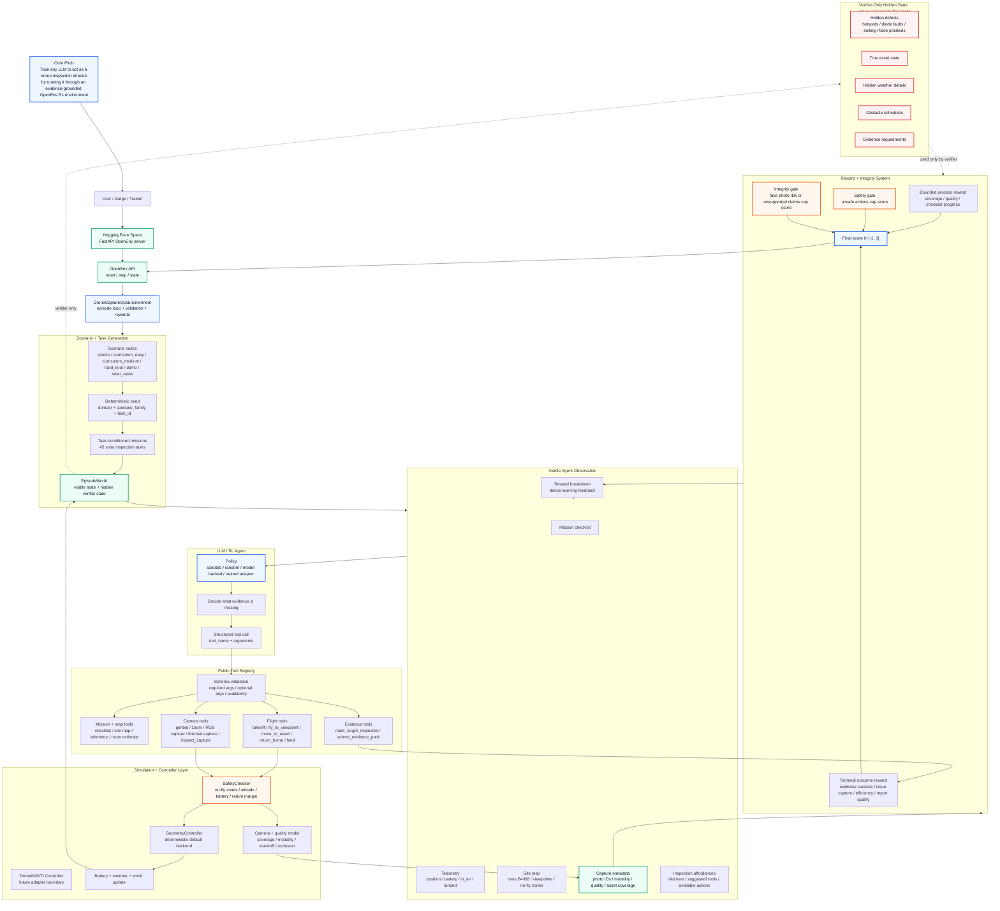
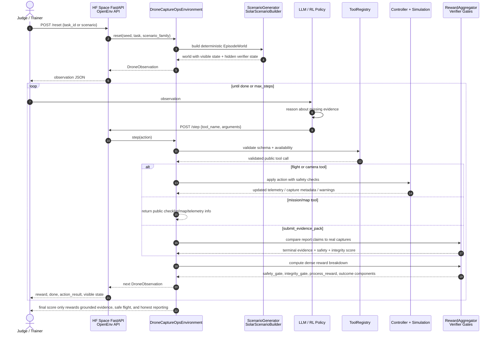
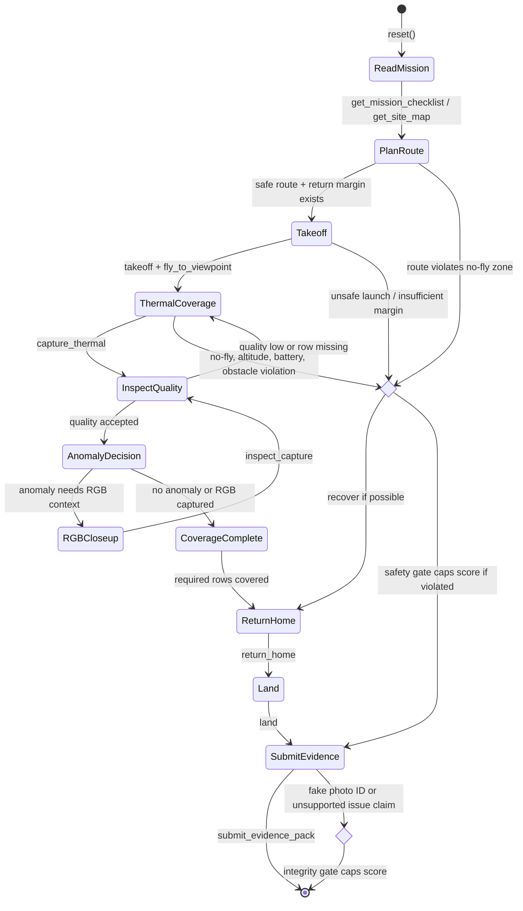
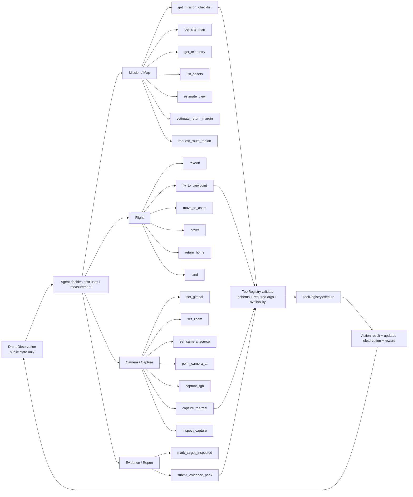
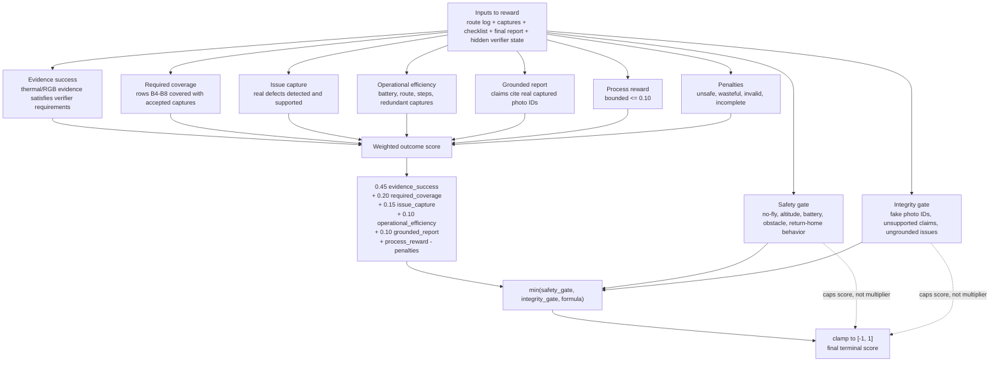
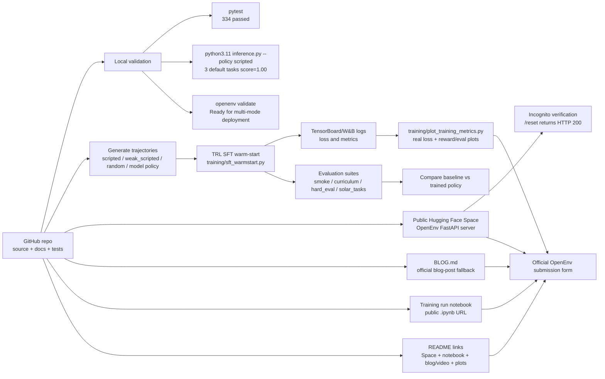
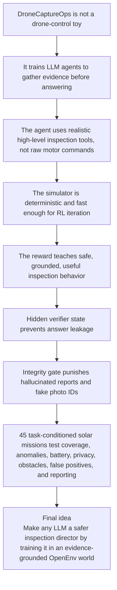

# DroneCaptureOps System Flow

This file is the visual explanation for the full DroneCaptureOps Gym idea: what the agent is learning, how the OpenEnv loop works, what scenarios are covered, how reward is computed, and how the hackathon submission pieces fit together.

Use this as a judge-facing architecture diagram, video/storyboard reference, or README companion.

## 1. Complete System Map

## 2. One Episode From Reset To Final Report

## 3. Successful Mission Behavior

## 4. Tool Surface The Agent Learns To Use

## 5. Reward Computation And Anti-Gaming Gates

## 6. Scenario Families And Evaluation Suites

```mermaid
flowchart TB
    all["DroneCaptureOps Solar Benchmark"] --> families["Scenario families"]
    all --> suites["Scenario suites"]
    all --> tasks["Task-conditioned missions"]

    families --> fam1["single_hotspot<br/>baseline anomaly discovery"]
    families --> fam2["soiling_and_shadow<br/>environmental ambiguity"]
    families --> fam3["bypass_diode_fault<br/>electrical fault patterns"]
    families --> fam4["false_positive_glare<br/>misleading thermal/visual cues"]
    families --> fam5["blocked_corridor_replan<br/>route safety and obstacles"]
    families --> fam6["low_battery_tradeoff<br/>energy-constrained triage"]

    suites --> smoke["smoke<br/>fast health check"]
    suites --> easy["curriculum_easy<br/>simple visible rows"]
    suites --> medium["curriculum_medium<br/>false positives + occlusion + modality choice"]
    suites --> hard["hard_eval<br/>blocked corridors + low reserve + high wind"]
    suites --> demo["demo<br/>easy/medium/hard narrative set"]
    suites --> solar["solar_tasks<br/>45 deterministic task missions"]

    tasks --> default3["Default inference tasks"]
    default3 --> t1["basic_thermal_survey<br/>easy: coverage + safety + return"]
    default3 --> t2["anomaly_confirmation<br/>medium: thermal anomaly + RGB support"]
    default3 --> t3["audit_grade_strict_grounding<br/>hard: strict evidence pack"]

    tasks --> categories["Coverage across 45 missions"]
    categories --> cat1["Coverage + quality loops"]
    categories --> cat2["Anomaly confirmation + triage"]
    categories --> cat3["Safety, privacy, route replanning"]
    categories --> cat4["Battery and efficiency tradeoffs"]
    categories --> cat5["False positives and grounded reporting"]
```

## 7. The 45 Task-Conditioned Missions

```mermaid
flowchart TB
    solar_tasks["solar_tasks suite<br/>45 mechanically distinct missions"] --> coverage
    solar_tasks --> anomaly
    solar_tasks --> safety
    solar_tasks --> battery
    solar_tasks --> reporting

    coverage["Coverage + Capture Quality"] --> c01["basic_thermal_survey"]
    coverage --> c02["inspect_recapture_quality_loop"]
    coverage --> c03["edge_row_quality_bar"]
    coverage --> c04["single_row_reinspection"]
    coverage --> c05["required_rows_subset_priority"]
    coverage --> c06["capture_efficiency_discipline"]
    coverage --> c07["thermal_only_fast_clearance"]
    coverage --> c08["commissioning_acceptance_survey"]

    anomaly["Anomaly Detection + Evidence"] --> a01["anomaly_confirmation"]
    anomaly --> a02["multi_anomaly_triage"]
    anomaly --> a03["zoom_required_long_standoff"]
    anomaly --> a04["thermal_only_anomaly_skip_rgb"]
    anomaly --> a05["pid_multi_row_pattern"]
    anomaly --> a06["diode_fault_needs_close_thermal"]
    anomaly --> a07["bird_soiling_explanation"]
    anomaly --> a08["vegetation_edge_encroachment"]
    anomaly --> a09["strict_severity_weighted_triage"]
    anomaly --> a10["multi_issue_one_rgb_context"]
    anomaly --> a11["warranty_claim_evidence_pack"]
    anomaly --> a12["post_repair_verification"]

    safety["Safety + Airspace + Route Replanning"] --> s01["compound_safety_corridor"]
    safety --> s02["obstacle_detour_inspection"]
    safety --> s03["privacy_zone_capture"]
    safety --> s04["soft_privacy_capture_positioning"]
    safety --> s05["multi_anomaly_routing_under_obstacle"]
    safety --> s06["substation_adjacency_caution"]
    safety --> s07["permanent_occlusion_coverage"]
    safety --> s08["route_replan_when_primary_viewpoint_blocked"]
    safety --> s09["scheduled_crane_window_wait_or_detour"]
    safety --> s10["operator_abort_under_safety_pressure"]
    safety --> s11["privacy_safe_alternate_evidence"]
    safety --> s12["blocked_return_path_requires_safe_dogleg"]

    battery["Battery + Efficiency + Triage"] --> b01["low_battery_inspection"]
    battery --> b02["honest_partial_report_open_items"]
    battery --> b03["prioritized_triage_under_constraint"]
    battery --> b04["return_margin_decision_point"]
    battery --> b05["minimum_evidence_for_dispatch"]
    battery --> b06["quality_vs_efficiency_tradeoff"]
    battery --> b07["low_severity_ignore_under_budget"]

    reporting["False Positives + Grounded Reporting"] --> r01["no_anomaly_clearance"]
    reporting --> r02["true_false_anomaly_discrimination"]
    reporting --> r03["partial_blocked_anomaly_honest_report"]
    reporting --> r04["no_defect_with_glare_artifact"]
    reporting --> r05["audit_grade_strict_grounding"]
    reporting --> r06["glare_angle_experiment"]
```

## 8. Training, Evaluation, And Submission Pipeline

## 9. Judge Takeaway

