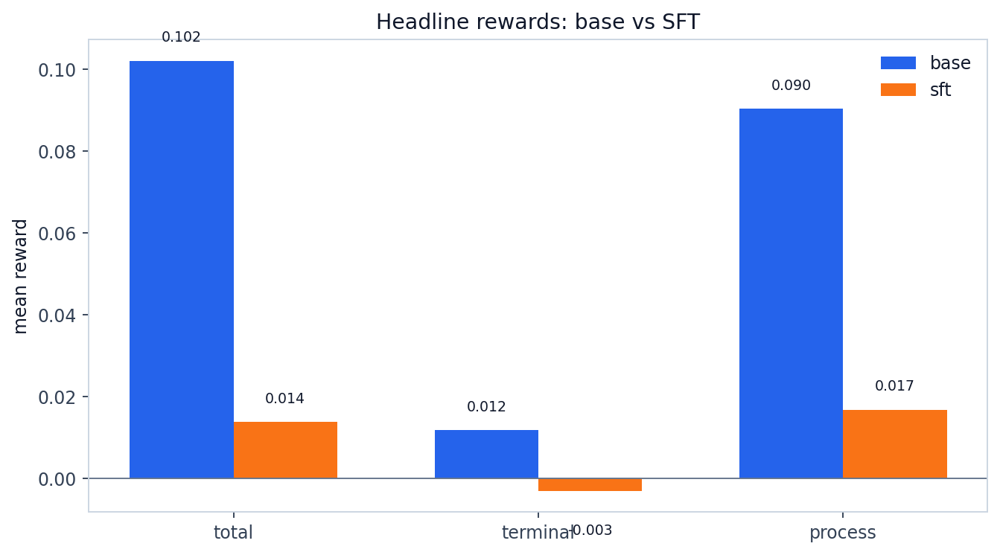
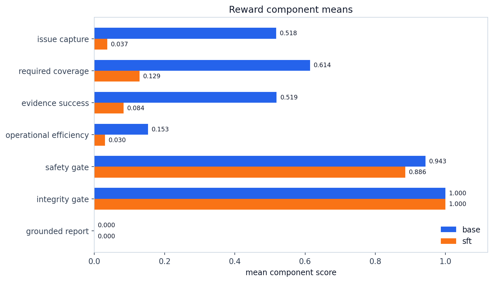
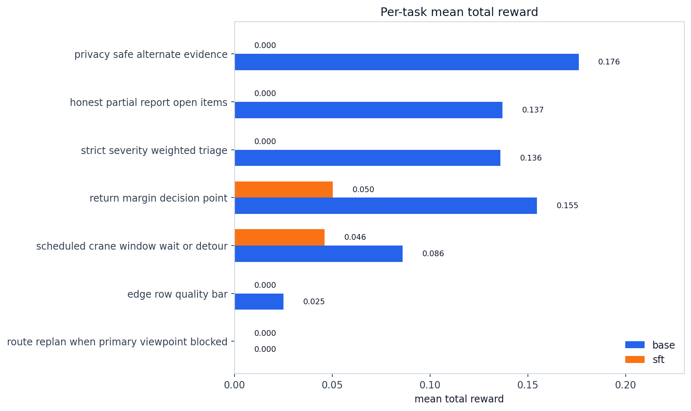
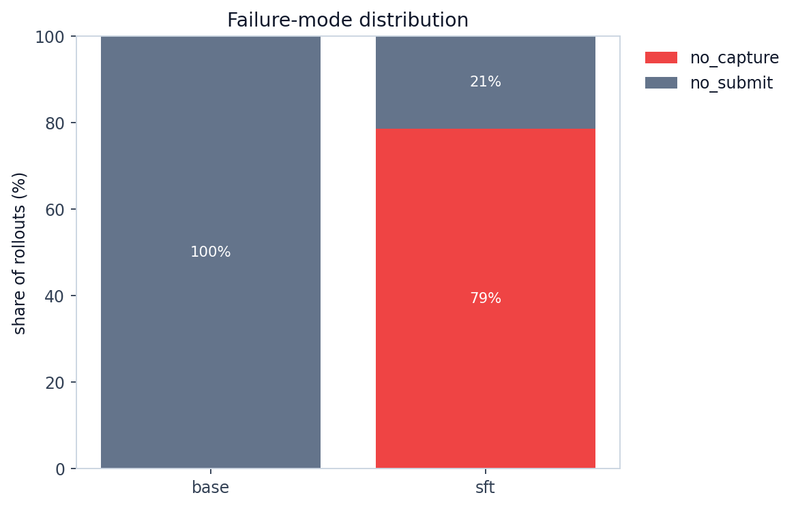
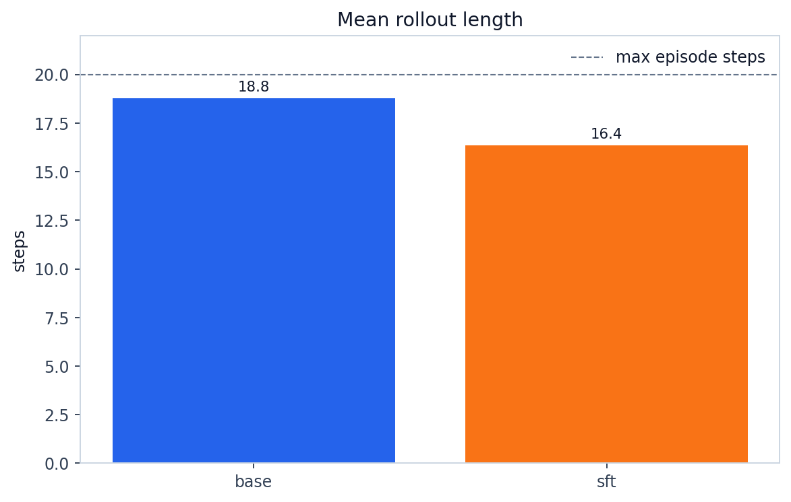

# Base vs SFT Eval: DroneCaptureOps Held-Out Tasks

This report is in the git repo and uses normal relative Markdown image embeds. The PNG chart files live in the same folder as this Markdown file, so Cursor preview should render them directly. GRPO is intentionally omitted.

**Eval job:** `rachit-suresh/69edce4bd70108f37acdfea3`  
**Output repo:** `rachit-suresh/dronecaptureops-eval-base-sft-grpo`  
**Suite:** 7 held-out DroneCaptureOps tasks x 2 seeds = 14 rollouts per variant  
**Base model:** `Qwen/Qwen3-4B-Instruct-2507`  
**SFT adapter:** `adityabhaskara/dronecaptureops-sft-qwen3-4b:last-checkpoint`  
**Max episode steps:** 20

## Bottom Line

The bare base model is clearly better than the current SFT adapter on this held-out eval. Both models have 0% task success, but base gets much higher partial reward and preserves useful drone behaviours. SFT mostly collapses into `no_capture` failures.

| metric | base | sft | sft - base |
| --- | ---: | ---: | ---: |
| success rate | 0.0% | 0.0% | +0.0 pp |
| mean total reward | 0.1021 | 0.0138 | -0.0883 |
| mean terminal reward | 0.0117 | -0.0030 | -0.0148 |
| mean process reward | 0.0904 | 0.0168 | -0.0736 |
| mean steps | 18.8 | 16.4 | -2.4 |
| parse error rate | 0.0% | 0.0% | +0.0 pp |

## Reward Components

The main regression is not parsing: both models have 0% parse errors. The regression is behavioral. Base captures useful evidence and covers required points; SFT often does not take photos at all.

| component | base | sft | sft - base |
| --- | ---: | ---: | ---: |
| issue_capture | 0.518 | 0.037 | -0.481 |
| required_coverage | 0.614 | 0.129 | -0.486 |
| evidence_success | 0.519 | 0.084 | -0.436 |
| operational_efficiency | 0.153 | 0.030 | -0.123 |
| safety_gate | 0.943 | 0.886 | -0.057 |
| integrity_gate | 1.000 | 1.000 | +0.000 |
| grounded_report | 0.000 | 0.000 | +0.000 |

## Per-Task Rewards

Base beats SFT on every held-out task except `route_replan_when_primary_viewpoint_blocked`, where both score 0.

## Failure Modes

Base fails because it never submits: it can still fly and gather partial evidence. SFT fails mostly because it never captures evidence.

| failure_mode | base | sft |
| --- | ---: | ---: |
| no_submit | 100.0% | 21.4% |
| no_capture | 0.0% | 78.6% |
| no_takeoff | 0.0% | 0.0% |

## Rollout Length

Base runs closer to the step budget because it keeps exploring and gathering partial evidence. SFT often terminates/fails earlier because it does not perform the required capture loop.

## Conclusion

For the current branch, the answer to "did SFT improve the model?" is **no** on the actual DroneCaptureOps held-out tasks. The current SFT adapter is worse than the bare Qwen3-4B base model. The next useful work is to fix the SFT dataset or train GRPO directly from base, with explicit reward pressure for `capture` and `submit` behaviours.

## Files

- `base_vs_sft_eval_report.md` - this Markdown report
- `base_vs_sft_stats.json` - machine-readable stats for base and SFT
- `headline_rewards_base_vs_sft.png`
- `reward_components_base_vs_sft.png`
- `per_task_rewards_base_vs_sft.png`
- `failure_modes_base_vs_sft.png`
- `mean_steps_base_vs_sft.png`
- `raw/summary_base.json`, `raw/summary_sft.json` - raw summaries
- `raw/rollouts_base.jsonl`, `raw/rollouts_sft.jsonl` - per-rollout records
